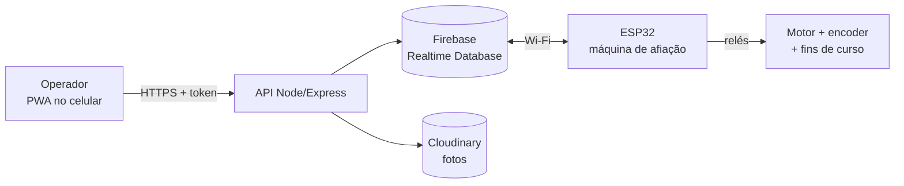

# ToolSave

Sistema de controle de afiação de brocas: um app web (PWA) que conversa com uma máquina de afiação controlada por ESP32 e mantém o histórico de cada broca — quantas vezes foi afiada, quanto de comprimento ela perdeu e como estava antes e depois.

Projeto Integrador desenvolvido para uma ferramentaria, unindo web, nuvem e hardware.

---

## O problema

Broca é consumível caro. Cada afiação tira alguns milímetros da ferramenta e, em algum momento, ela precisa ser descartada. Na prática, esse controle costuma ser feito na memória do operador ou em papel: ninguém sabe ao certo quantas afiações uma broca já levou, nem quanto de vida útil ainda resta.

O ToolSave automatiza esse controle: a própria máquina mede a broca ao afiar e registra o resultado, sem ninguém precisar anotar nada.

---

## Como funciona



O ponto central é o Realtime Database: o app **nunca fala direto com o ESP32**. O app escreve um estado no banco, o ESP32 lê esse estado a cada meio segundo e age; quando termina, é ele quem escreve o resultado de volta. É uma fila de comandos simples, e isso resolve o problema de a máquina e o celular não estarem na mesma rede.

---

## O ciclo de uma afiação

Do lado do operador (PWA) e o que acontece por trás:

| # | O que o operador faz | O que acontece por baixo |
|---|---|---|
| 1 | Faz login | Firebase Auth devolve um ID token; toda chamada à API vai com `Authorization: Bearer <token>` |
| 2 | Escolhe a broca na lista | `PUT /brocas/selectedID/:id` grava a broca ativa em `BrocaSelecionadaID` |
| 3 | Aponta a câmera e tira a foto de início | Foto vai para o Cloudinary; a URL é salva em `Fotos/{id}/fotos/inicio` |
| 4 | — | O app grava o estado `iniciando`. O ESP32 lê, aciona o relé de avanço e começa a contar os pulsos do encoder |
| 5 | Acompanha a tela | Ao bater no fim de curso, o ESP32 para o motor e grava o estado `parado` |
| 6 | — | No estado `parado`, o ESP32 converte os pulsos em milímetros e grava `novoComp` na broca; o app soma +1 em `numeroAfiacoes` e registra a data |
| 7 | — | Estado `c` (concluído): o ESP32 aciona o relé de recuo até o segundo fim de curso e grava `finalizado` |
| 8 | Confirma no botão de check | Foto de fim enviada, `BrocaSelecionadaID` volta para `0` e o operador cai de volta na lista de brocas |

A medição é geométrica, não estimada: o encoder tem 400 pulsos por rotação e a rosca sem fim avança 2 mm por volta, então cada pulso vale **0,005 mm**. O comprimento é `pulsos × 0,005`.

---

## O que o app faz

- **Login e cadastro** com Firebase Authentication; todas as telas verificam o token antes de abrir.
- **Cadastro de brocas** com tipo, diâmetro e comprimento, com ID sequencial automático.
- **Lista com busca**, edição e exclusão de brocas.
- **Resumo de estoque**: total de brocas, quantas estão novas (zero afiações) e quantas já foram usadas.
- **Tela da máquina**: câmera ao vivo, dados da broca selecionada, e os botões de iniciar, reiniciar e parar o ciclo.
- **Fotos de antes e depois** de cada broca, hospedadas no Cloudinary.
- **Relatórios** com comparativo antes/depois por broca, gráficos de uso e de afiações (Chart.js), filtro por mês/período e exportação para Excel (SheetJS).
- **PWA**: instalável no celular, com service worker cacheando as páginas, CSS e JS.

---

## Stack

**Front-end (PWA)** — HTML, CSS e JavaScript ES modules, sem framework. Chart.js para gráficos, SheetJS para exportar planilha, service worker + manifest para instalação.

**Back-end** — Node.js com Express 5, Firebase Admin SDK (Realtime Database e verificação de token), Multer + streamifier para receber a foto em memória e Cloudinary para hospedá-la.

**Firmware** — C++ com Arduino framework no ESP32, via PlatformIO, usando a Firebase-ESP-Client para falar com o Realtime Database.

**Infra** — Firebase Realtime Database como banco e canal de comunicação; Cloudinary como storage de imagens.

---

## Estrutura

```
server.js              Express, inicializa Firebase Admin e Cloudinary, monta as rotas
rotas/
  auth.js              middleware authenticateToken + rotas de login/registro/check
  brocas.js            CRUD de brocas, estoque e seleção da broca ativa
  maquina.js           leitura e escrita do estado da máquina
  fotos.js             upload para o Cloudinary e vínculo da URL com a broca
public/
  pages/               index (login), menu, brocas, maquina, relatorio, config
  js/                  firebaseConfig.js (auth + apiFetch), brocas-front.js,
                       maquina.js, relatorio.js, grafico.js, detalhesRelatorio.js
  css/, assets/        estilos e imagens
  manifest.json        PWA
  serviceWorker.js     cache offline
main.cpp               firmware em uso: lê o estado no Firebase e comanda a máquina
firebase.cpp           versão anterior do mesmo firmware
esp32.cpp              variante standalone: ESP32 vira Access Point com painel próprio
platformio.ini         build do ESP32 (board esp32dev)
```

---

## Modelo de dados (Realtime Database)

```
Brocas/{id}                  { id, tipo, diametro, comprimento, novoComp,
                               numeroAfiacoes, dataAdicao, dataAfiacao }
BrocaSelecionadaID/id        broca que a máquina deve processar ("0" = nenhuma)
EstadoMaquina/estadoAtual    { estado, atualizadoEm }
Fotos/{id}/fotos/inicio      { url, timestamp }
Fotos/{id}/fotos/fim         { url, timestamp }
```

### Estados da máquina

O firmware faz o switch pela primeira letra do estado.

| Estado | Quem escreve | O que a máquina faz |
|---|---|---|
| `iniciando` | app | Zera o encoder, aciona o relé de avanço e conta pulsos até o fim de curso 1 |
| `parado` | ESP32 | Calcula o comprimento, grava `novoComp` na broca e passa para `c` |
| `c` (concluído) | ESP32 | Aciona o relé de recuo até o fim de curso 2 |
| `finalizado` | ESP32 / app | Aguarda nova ordem |
| `reiniciando` | app | Recua a máquina para a posição inicial |

---

## API

Todas as rotas exigem o header `Authorization: Bearer <idToken>` do Firebase.

| Método | Rota | Para quê |
|---|---|---|
| POST | `/auth/login` · `/auth/register` | Valida o token emitido no front |
| GET | `/auth/check` | Confere se a sessão ainda vale |
| GET | `/brocas/puxarBrocas` | Lista todas as brocas ordenadas por ID |
| POST | `/brocas/guardarBroca` | Cadastra uma broca (ID sequencial automático) |
| PUT | `/brocas/editarBroca/:id` | Atualiza campos da broca |
| DELETE | `/brocas/deletarBroca/:id` | Remove a broca |
| GET | `/brocas/estoqueBrocas` | Totais de brocas novas e usadas |
| GET | `/brocas/verificarBD/:id` | Confere se um ID já existe |
| PUT | `/brocas/selectedID/:id` | Define a broca que a máquina vai processar |
| POST | `/maquina/alterarEstado` | Envia um comando para a máquina |
| GET | `/maquina/estadoAtual` | Lê o estado atual |
| POST | `/fotos/upload` | Sobe a foto para o Cloudinary e devolve a URL |
| POST | `/fotos/salvarURL` | Vincula a URL à broca (`inicio` ou `fim`) |
| GET | `/fotos/puxarURL/:id` | Devolve as fotos de uma broca |

---

## Hardware

| Pino | Função |
|---|---|
| D12 | Relé 1 — avanço do motor |
| D13 | Relé 2 — recuo do motor |
| D18 | Fim de curso 1 (fim do avanço) |
| D19 | Fim de curso 2 (posição inicial) |
| D25 | Encoder, canal B |
| D26 | Encoder, canal A (interrupção) |

Os relés trabalham em lógica invertida (`HIGH` = desligado) e o firmware desliga os dois motores sempre que o estado não é de execução — é a trava de segurança do loop.

---

## Rodando o projeto

**Servidor**

```bash
npm install
npm start          # http://localhost:3000
```

Crie um `.env` na raiz com:

```
PORT=3000
FIREBASE_TYPE=service_account
FIREBASE_PROJECT_ID=
FIREBASE_PRIVATE_KEY_ID=
FIREBASE_PRIVATE_KEY=
FIREBASE_CLIENT_EMAIL=
FIREBASE_CLIENT_ID=
FIREBASE_AUTH_URI=
FIREBASE_TOKEN_URI=
FIREBASE_AUTH_PROVIDER_X509_CERT_URL=
FIREBASE_CLIENT_X509_CERT_URL=
FIREBASE_UNIVERSE_DOMAIN=googleapis.com
FIREBASE_DATABASE_URL=
CLOUDINARY_CLOUD_NAME=
CLOUDINARY_API_KEY=
CLOUDINARY_API_SECRET=
```

As credenciais do Firebase saem do arquivo JSON de service account (Console do Firebase → Configurações do projeto → Contas de serviço).

**Firmware**

```bash
pio run -t upload      # PlatformIO, board esp32dev
pio device monitor     # 115200 baud
```

Antes de gravar, ajuste o SSID, a senha do Wi-Fi e as credenciais do Firebase no topo do `main.cpp`.

---

## Limitações conhecidas

- As fotos de início e fim sobrescrevem as da afiação anterior — o histórico guarda só o último ciclo de cada broca.
- O firmware se conecta ao Realtime Database em modo de teste, sem autenticação; em produção isso precisa virar um usuário com regras de acesso.
- O app espera um tempo fixo antes de recarregar as medidas na tela da máquina, em vez de escutar a mudança no banco.
- `esp32.cpp` e `firebase.cpp` são caminhos alternativos que ficaram no repositório; o firmware em uso é o `main.cpp`.
